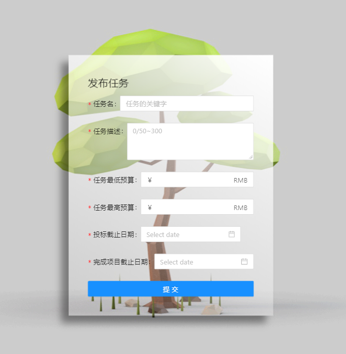
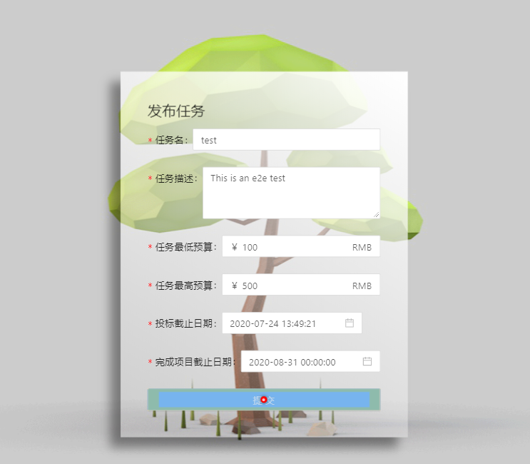
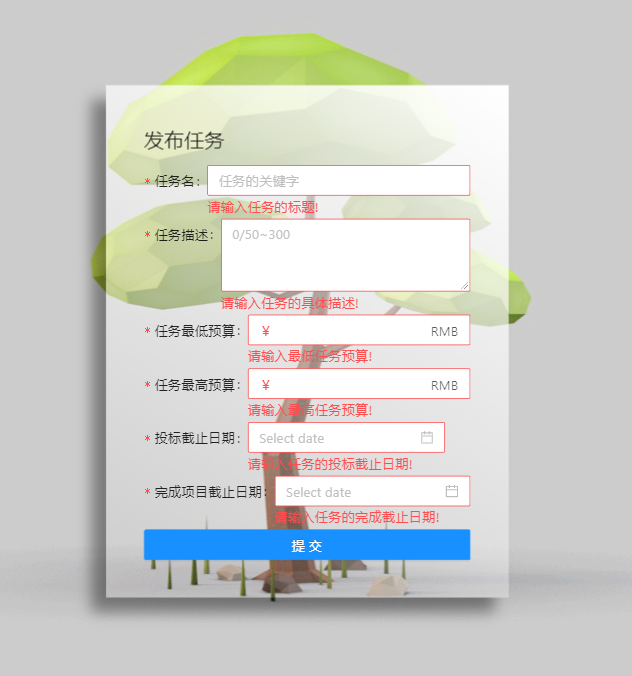
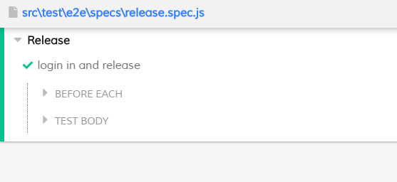
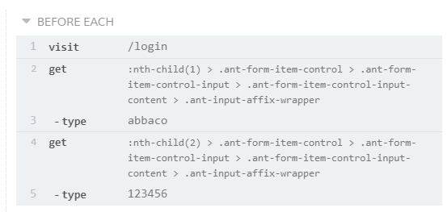
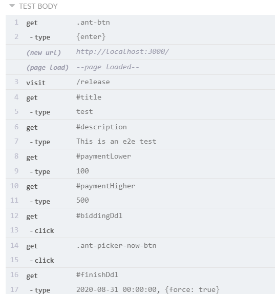
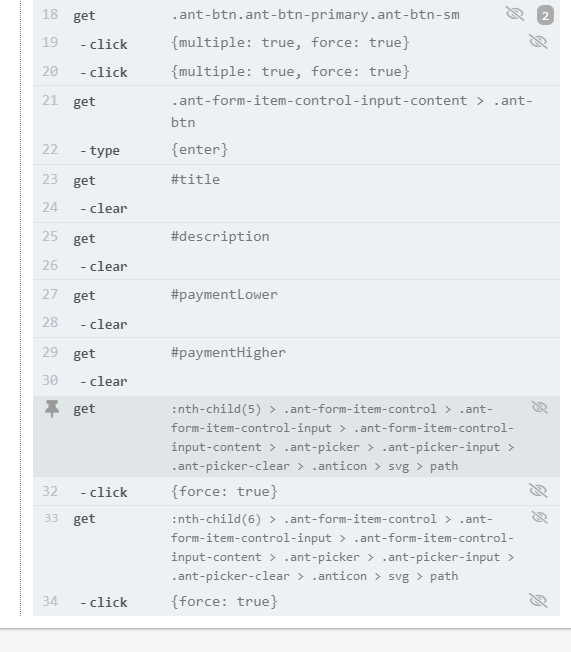

#### 利用Cypress端对端测试

1）环境配置：

cypress是在mocha式API基础上构建的一套开箱可用的E2E测试框架，对比其他测试框架，它提供一套自己的最佳实践方案，无需其他测试工具库，配置方便简单但功能异常强大，还提供了一个强大的GUI图形工具。入门简单，上手方便。依照教程https://blog.csdn.net/sinat_33312523/article/details/83093207?biz_id=102&utm_term=cypress%20react%E7%8E%AF%E5%A2%83%E9%85%8D%E7%BD%AE&utm_medium=distribute.pc_search_result.none-task-blog-2~all~sobaiduweb~default-0-83093207&spm=1018.2118.3001.4187我们成功配置了react-cypress环境。

2）端对端测试

我们小组通过讨论，决定对“发布任务”这一业务进行端对端测试，我们需要通过登录，进入用户页面，然后通过点击发布任务按钮进行发布任务操作，发布的任务会存入后端数据当中。

首先在每次test之前，我们要确保我们处在已登录状态。

```
 beforeEach(() => {
        cy.restoreLocalStorage();
        cy.visit('/login');
        cy.get(':nth-child(1) > .ant-form-item-control > .ant-form-item-control-input > .ant-form-item-control-input-content > .ant-input-affix-wrapper').type('abbaco');
        cy.get(':nth-child(2) > .ant-form-item-control > .ant-form-item-control-input > .ant-form-item-control-input-content > .ant-input-affix-wrapper').type('123456');

    });
```


由图可知，cypress自动输入了用户名和密码，并通过点击登录按钮（cy.get('.ant-btn').type('{enter}');），我们成功完成了登录操作，进入了用户页面，后端也显示抓取到了用户信息：


但之后我们点击发布一个项目按钮，页面并没有跳转，然后我们发现localStorage.findItem（'user'）为空，通过查阅资料，我们发现每次测试操作后，cypress会自动clear localStorage，于是我们添加了两个函数：

```
let LOCAL_STORAGE_MEMORY = {};
Cypress.Commands.add("saveLocalStorage",()=>{
    Object.keys(localStorage).forEach(key => {
        LOCAL_STORAGE_MEMORY[key] = localStorage[key];
    })
});

Cypress.Commands.add("restoreLocalStorage",()=>{
    Object.keys(LOCAL_STORAGE_MEMORY).forEach(key => {
        localStorage.setItem(key,LOCAL_STORAGE_MEMORY[key]);
    })
});
```


之后在钩子函数beforeEach中调用cy.restoreLocalStorage();在afterEach中调用cy.saveLocalStorage()，重新运行，果然成功跳转到了发布任务界面



   执行如下操作

```
cy.get('#title').type('test');
        cy.get('#description').type('This is an e2e test');
        cy.get('#paymentLower').type('100');
        cy.get('#paymentHigher').type('500');
        cy.get('#biddingDdl').click().get('.ant-picker-now-btn').click();
        cy.get('#finishDdl').type('2020-08-31 00:00:00',{force:true});
        cy.get('.ant-btn.ant-btn-primary.ant-btn-sm').click({multiple:true ,force:true});
        cy.get('.ant-form-item-control-input-content > .ant-btn').type('{enter}');
```




点击提交按钮之后，后端收到了数据存入信息


在数据库中，我们看到了我们刚写入的信息：


之后我们清除了所有输入：

```
        cy.get('#description').clear();
        cy.get('#paymentLower').clear();
        cy.get('#paymentHigher').clear();
        cy.get(':nth-child(5) > .ant-form-item-control > .ant-form-item-control-input > .ant-form-item-control-input-content > .ant-picker > .ant-picker-input > .ant-picker-clear > .anticon > svg > path').click({force: true});
        cy.get(':nth-child(6) > .ant-form-item-control > .ant-form-item-control-input > .ant-form-item-control-input-content > .ant-picker > .ant-picker-input > .ant-picker-clear > .anticon > svg > path').click({force: true});
```




自此，所有test运行完毕，全部通过：









